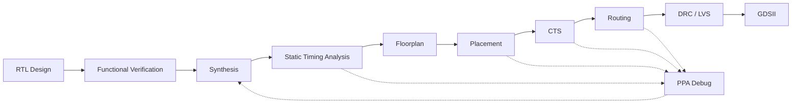

<div align="center">

<!-- Header -->


<br>

<!-- Typing line -->


<br><br>

<a href="https://github.com/djay23github">
  
</a>
<a href="https://www.linkedin.com/in/dhananjayjoshi2310/">
  
</a>
<a href="mailto:djayjoshi23@gmail.com">
  
</a>

<br><br>
</div>

---

## `whoami`

```systemverilog
module dhananjay_joshi;

  string role        = "Silicon Design Engineer";
  string focus       = "RTL, PD, Circuit Design, DFT, Microarchitecture";

  initial begin
    $display("Actively looking for Full Time Opportunities in the domain.");
  end

endmodule
```
---

## Tech Constellation

<div align="center">

### HDL / Programming Languages


### OpenSource ASIC Flow


### Industry Tools


### PDKs / Nodes worked on


</div>

---

## Projects

<div align="center">

<table>
<tr>
<td width="50%" valign="top">
  
### Block Truncation Coding Unit

<a href="https://github.com/djay23github/Block_Truncation_Coding_Unit">

</a>

```text
Domain    : Image Compression Hardware + 7nm tech node
Built     : RTL2GDSII Flow using Synopsys Tools
Focus     : datapath design, STA, Power analysis
Signals   : pixels, blocks, threshold, compressed data
```

</td>
<td width="50%" valign="top">

### SDRAM Module Design

<a href="https://github.com/djay23github/SDRAM-Module-Design">

</a>

```text
Domain    : Memory design
Built     : behavioral + realistic SDRAM models
Focus     : ACT, READ, WRITE, NOP, timing delay
Signals   : addr, data, command, bank, latency
```

</td>
</tr>
<tr>
<td width="50%" valign="top">
  
### PacketLinkSoC Design

<a href="https://github.com/djay23github/PacketLink_SoC">

</a>

```text
Domain    : End-to-end ASIC Design Flow
Built     : UART-SERDES Bridge 
Focus     : CDC, Macro Integration, Packetization 
Signals   : tx/rx, fifo_read/write, packet_ready/valid
```

</td>
<td width="50%" valign="top">

### Power Management Unit FSM

<a href="https://github.com/djay23github/RTL2GDSII_Power_Management_Unit_Design">

</a>

```text
Domain    : Low-power SoC control flow
Built     : FSM + verification + PD Flow
Focus     : states, resets, power control, timing
Signals   : sleep_req, wakeup, clk_gate, retention
```

</td>
</tr>

</table>

</div>

---

## What I Am Building Toward

<div align="center">



</div>

---

## GitHub Telemetry

<div align="center">


---

## Connect

<div align="center">

<a href="https://www.linkedin.com/in/dhananjayjoshi2310/">
  
</a>
<a href="mailto:djayjoshi23@gmail.com">
  
</a>

<br><br>


</div>
